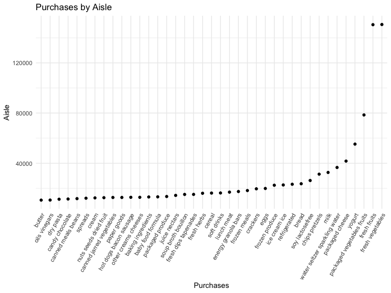

P8105 HW 3
================
AJ Catalano
11/10/2021

``` r
library(tidyverse)
```

    ## ── Attaching packages ─────────────────────────────────────── tidyverse 1.3.1 ──

    ## ✓ ggplot2 3.3.5     ✓ purrr   0.3.4
    ## ✓ tibble  3.1.5     ✓ dplyr   1.0.7
    ## ✓ tidyr   1.1.4     ✓ stringr 1.4.0
    ## ✓ readr   2.0.2     ✓ forcats 0.5.1

    ## ── Conflicts ────────────────────────────────────────── tidyverse_conflicts() ──
    ## x dplyr::filter() masks stats::filter()
    ## x dplyr::lag()    masks stats::lag()

``` r
library(p8105.datasets)
data("instacart")

knitr::opts_chunk$set(
  fig.width = 8,
  fig.height = 6,
  out.width = "80%"
)

theme_set(theme_minimal() + theme(legend.position = "bottom"))

options(
  ggplot2.continuous.color = "viridis",
  ggplot2.continuous.fill = "viridis"
)

scale_colour_discrete = scale_color_viridis_d
scale_fill_discrete = scale_fill_viridis_d
```

## Problem 1

The instacart dataset contains 1384617 observations and 15 variables. It
contains information about Instacart orders, including order numbers,
product IDs, product names, and product location (department and
aisles). For example, someone ordered Lightly Smoked Sardines in Olive
Oil, a product that is located in the “canned meat seafood” aisle of the
“canned goods” department.

``` r
# determining number of aisles:

instacart %>%
  summarize(aisles_tot = n_distinct(aisle))
```

    ## # A tibble: 1 × 1
    ##   aisles_tot
    ##        <int>
    ## 1        134

The number of unique aisles from this dataset is 134.

The 10 most popular aisles are provided in the table below:

| aisle                         | aisle_freq |
|:------------------------------|-----------:|
| fresh vegetables              |     150609 |
| fresh fruits                  |     150473 |
| packaged vegetables fruits    |      78493 |
| yogurt                        |      55240 |
| packaged cheese               |      41699 |
| water seltzer sparkling water |      36617 |
| milk                          |      32644 |
| chips pretzels                |      31269 |
| soy lactosefree               |      26240 |
| bread                         |      23635 |

Below is a plot showing the number of items ordered in each aisle for
aisles with \> 10000 items ordered.

``` r
instacart %>% 
  count(aisle) %>%
  filter(n > 10000) %>% 
  mutate(aisle = fct_reorder(aisle, n)) %>% 
  ggplot(aes(x = aisle, y = n)) +
  geom_point() +
  labs(title = "Purchases by Aisle",
       x = "Purchases",
       y = "Aisle") + 
  theme(axis.text.x = element_text(angle = 60, hjust = 1))
```



A table showing the three most popular items (by number of purchases)
for `packaged vegetables fruits`, `baking ingredients`, and
`dog food care` is shown below:

``` r
# why doesn't aisle == c() give correct table (n is lower, rank is correct)

instacart %>% 
  filter(aisle %in% c("baking ingredients", 
                    "dog food care", 
                    "packaged vegetables fruits")) %>% 
  group_by(aisle) %>%
  count(product_name) %>% 
  arrange(desc(n)) %>% 
  mutate(
    rank = min_rank(desc(n))) %>%
  filter(rank <= 3) %>% 
  knitr::kable()
```

| aisle                      | product_name                                  |    n | rank |
|:---------------------------|:----------------------------------------------|-----:|-----:|
| packaged vegetables fruits | Organic Baby Spinach                          | 9784 |    1 |
| packaged vegetables fruits | Organic Raspberries                           | 5546 |    2 |
| packaged vegetables fruits | Organic Blueberries                           | 4966 |    3 |
| baking ingredients         | Light Brown Sugar                             |  499 |    1 |
| baking ingredients         | Pure Baking Soda                              |  387 |    2 |
| baking ingredients         | Cane Sugar                                    |  336 |    3 |
| dog food care              | Snack Sticks Chicken & Rice Recipe Dog Treats |   30 |    1 |
| dog food care              | Organix Chicken & Brown Rice Recipe           |   28 |    2 |
| dog food care              | Small Dog Biscuits                            |   26 |    3 |

Below is a table showing the mean hour of the day that coffee ice cream
and pink lady apples are ordered for each day of the week.

``` r
instacart %>% 
  filter(product_name %in% c("Pink Lady Apples", "Coffee Ice Cream")) %>%
  select(order_dow, product_name, order_hour_of_day) %>% 
  group_by(order_dow, product_name) %>% 
  summarize(
    mean_hour = mean(order_hour_of_day)
    ) %>%
  pivot_wider(names_from = order_dow, values_from = mean_hour) %>% 
  knitr::kable()
```

    ## `summarise()` has grouped output by 'order_dow'. You can override using the `.groups` argument.

| product_name     |        0 |        1 |        2 |        3 |        4 |        5 |        6 |
|:-----------------|---------:|---------:|---------:|---------:|---------:|---------:|---------:|
| Coffee Ice Cream | 13.77419 | 14.31579 | 15.38095 | 15.31818 | 15.21739 | 12.26316 | 13.83333 |
| Pink Lady Apples | 13.44118 | 11.36000 | 11.70213 | 14.25000 | 11.55172 | 12.78431 | 11.93750 |

## Problem 2

format the data to use appropriate variable names; focus on the “Overall
Health” topic include only responses from “Excellent” to “Poor” organize
responses as a factor taking levels ordered from “Poor” to “Excellent”

``` r
data("brfss_smart2010")

brfss_overall_health = 
  brfss_smart2010 %>% 
  janitor::clean_names() %>% 
  rename(
    state = locationabbr,
    county = locationdesc,
    ) %>%
  filter(
    topic == "Overall Health",
    response %in% 
      c("Excellent", "Very good", "Good", "Fair", "Poor")
    ) %>%
  mutate(
    response = factor(response, levels = c("Poor", "Fair", "Good", "Very good", "Excellent")))
```

``` r
# code to show all unique values for a given variable

unique(brfss_smart2010[c("Response")])
```

In 2002, 6 states were observed at 7 or more locations. In 2010, 14
states were observed at 7 or more locations.

``` r
brfss_overall_health %>% 
  filter(year %in% c(2002, 2010)) %>% 
  select(state, county, year) %>% 
  group_by(year, state) %>% 
  summarize(
    locations = n_distinct(county)
  ) %>% 
  filter(
    locations >= 7
  ) %>%
  pivot_wider(
    names_from = state,
    values_from = locations
  )
```

    ## `summarise()` has grouped output by 'year'. You can override using the `.groups` argument.

    ## # A tibble: 2 × 16
    ## # Groups:   year [2]
    ##    year    CT    FL    MA    NC    NJ    PA    CA    CO    MD    NE    NY    OH
    ##   <int> <int> <int> <int> <int> <int> <int> <int> <int> <int> <int> <int> <int>
    ## 1  2002     7     7     8     7     8    10    NA    NA    NA    NA    NA    NA
    ## 2  2010    NA    41     9    12    19     7    12     7    12    10     9     8
    ## # … with 3 more variables: SC <int>, TX <int>, WA <int>

Construct a dataset that is limited to Excellent responses, and
contains, year, state, and a variable that averages the data_value
across locations within a state. Make a “spaghetti” plot of this average
value over time within a state (that is, make a plot showing a line for
each state across years – the geom_line geometry and group aesthetic
will help).

``` r
brfss_overall_health %>% 
  filter(response == "Excellent") %>% 
  group_by(year, state) %>% 
  summarize(
    mean_data_value = mean(data_value)
  ) %>% 
  ggplot(aes(x = year, y = mean_data_value, color = state)) +
  geom_line() +
  labs(
    title = "Mean Data Value v. Year",
    x = "Year",
    y = "Mean Data Value"
  ) +
  theme_minimal() +
  theme(legend.position = "none")
```

    ## `summarise()` has grouped output by 'year'. You can override using the `.groups` argument.

    ## Warning: Removed 3 row(s) containing missing values (geom_path).


Make a two-panel plot showing, for the years 2006, and 2010,
distribution of data_value for responses (“Poor” to “Excellent”) among
locations in NY State.

``` r
brfss_overall_health %>% 
  filter(
    year %in% c(2006, 2010),
    response %in% c("Excellent", "Very good", "Good", "Fair", "Poor"),
    state == "NY"
  ) %>% 
  ggplot(aes(x = response, y = data_value)) +
  geom_boxplot() +
  facet_grid(. ~ year) +
  theme_minimal() +
  theme(axis.text.x = element_text(angle = 60, hjust = 1))
```


## Problem 3
